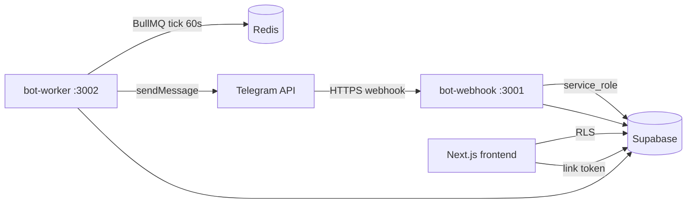
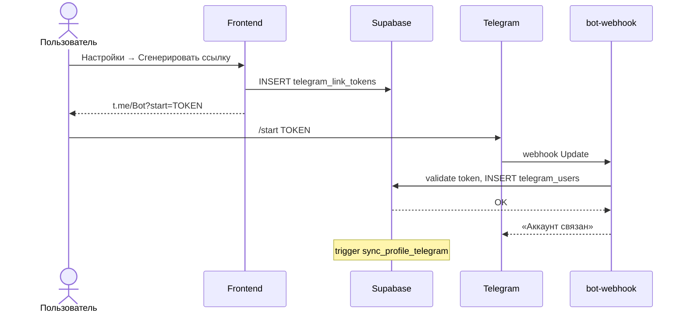
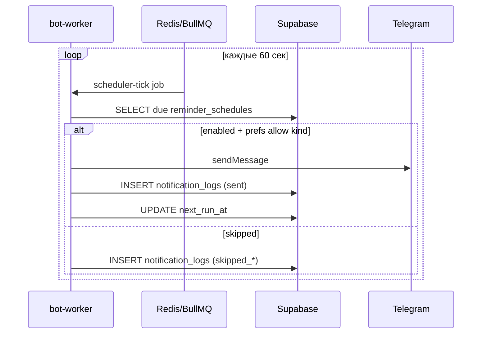
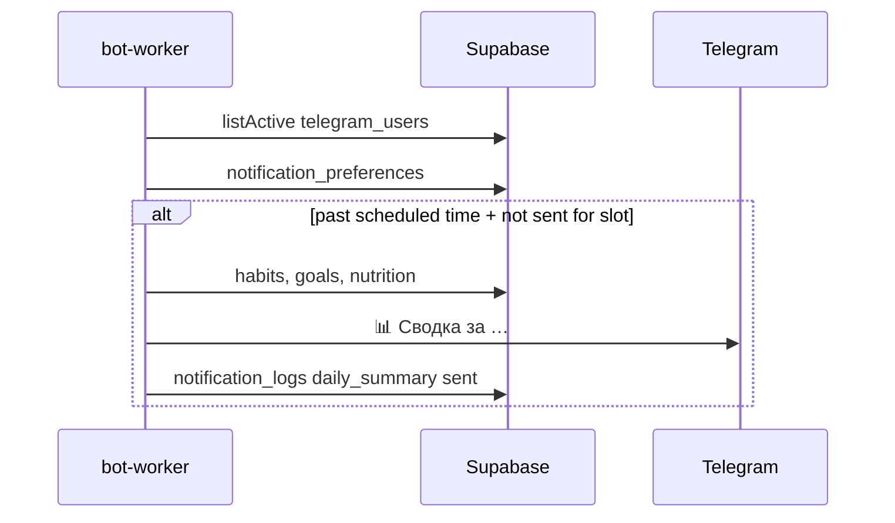
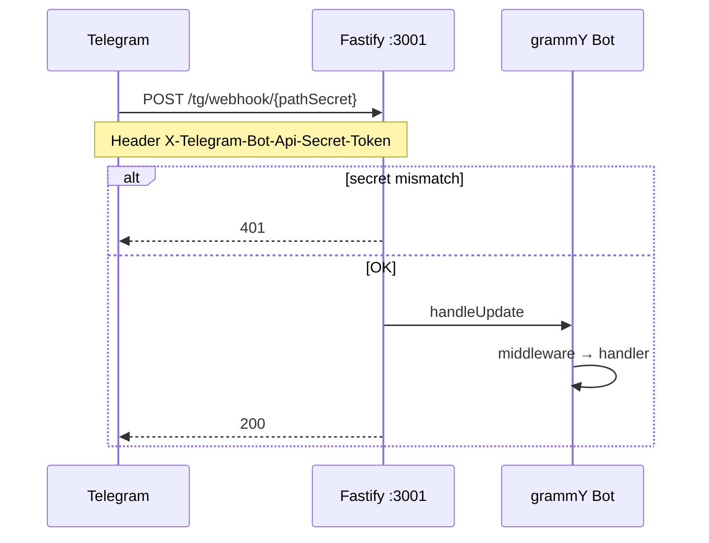

# Архитектура Telegram-бота Tracker

## Компоненты

| Процесс | Entry-point | Назначение |
|---|---|---|
| **bot-webhook** | `start-webhook.ts` | Приём updates, команды, callbacks |
| **bot-worker** | `start-worker.ts` | Cron напоминания + дайджесты |
| **redis** | — | Очередь BullMQ |
| **frontend** | Next.js | UI, API routes, deep-link токены |

---

## 1. Связка аккаунта (deep-link)

---

## 2. Пользовательское напоминание (reminder_schedules)

---

## 3. Ежедневная сводка (daily_summary)

Идемпотентность: повтор не отправляется, если `sent` уже есть **после** сегодняшнего `daily_summary_time` (не с полуночи).

---

## 4. Webhook-запрос (production)

Трёхуровневая защита:
1. HTTPS (Telegram requirement)
2. Случайный `pathSecret` в URL
3. `headerSecret` в `X-Telegram-Bot-Api-Secret-Token`

---

## Observability

| Endpoint | Процесс | Описание |
|---|---|---|
| `GET /healthz` | webhook :3001, worker :3002 | Supabase + Redis checks |
| `GET /metrics` | webhook :3001, worker :3002 | Prometheus text counters |

Метрики: `tracker_http_requests_total`, `tracker_webhook_updates_total`, `tracker_reminders_sent_total`, `tracker_digests_sent_total`, `tracker_worker_jobs_total`.
